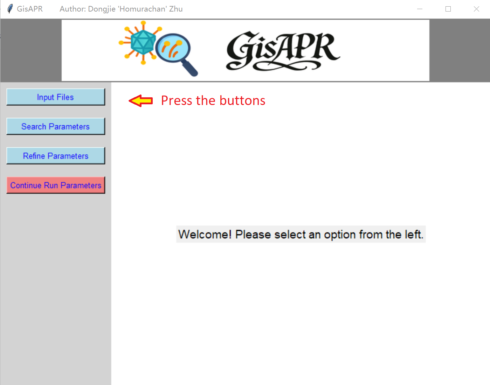
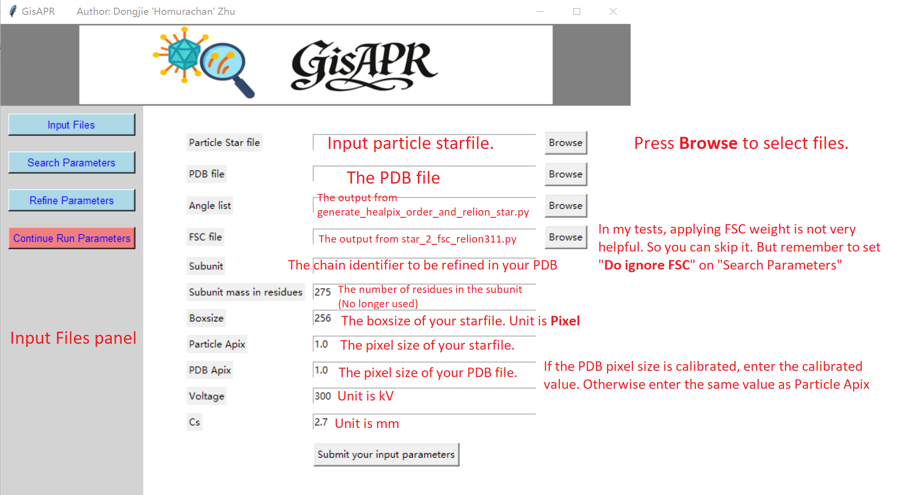
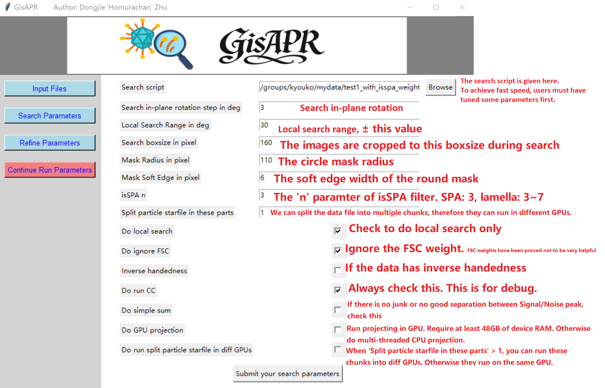
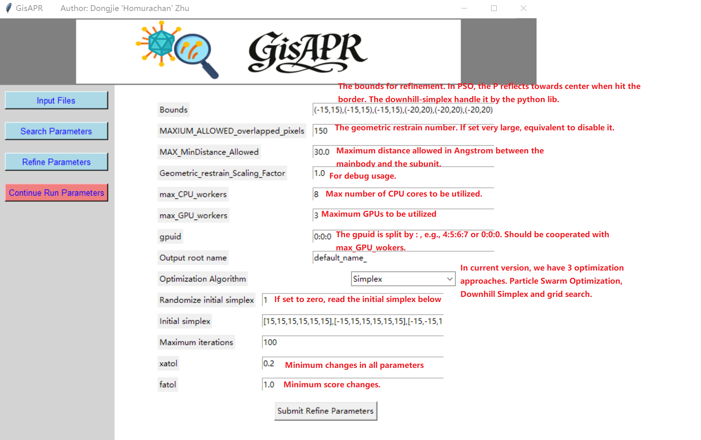
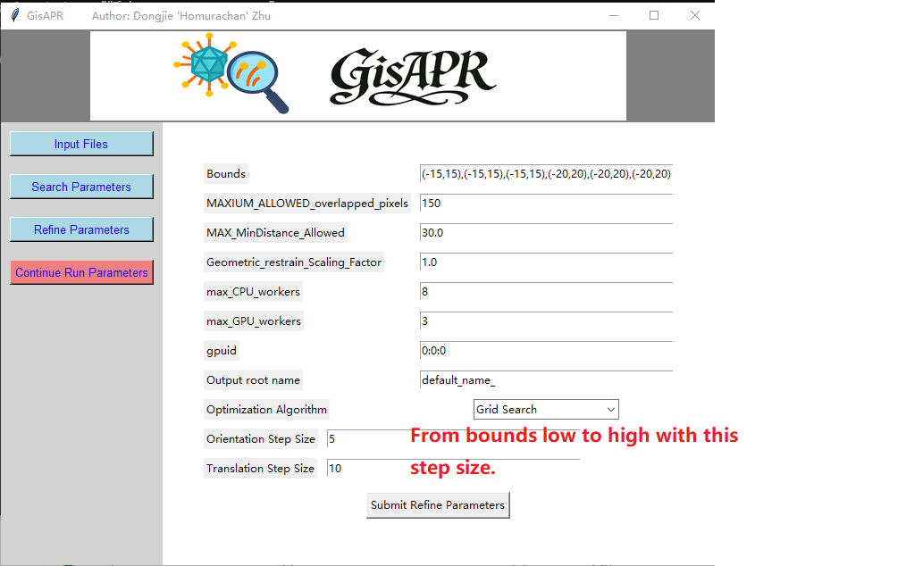
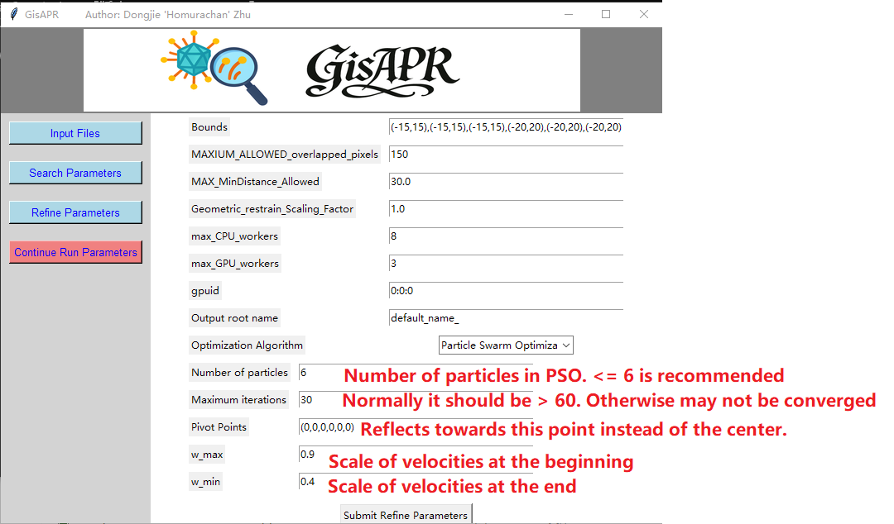
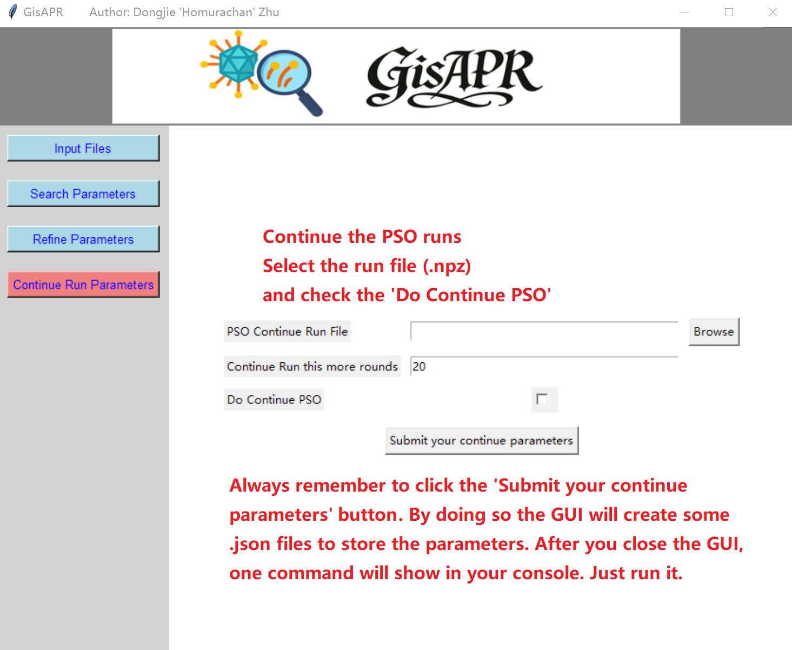
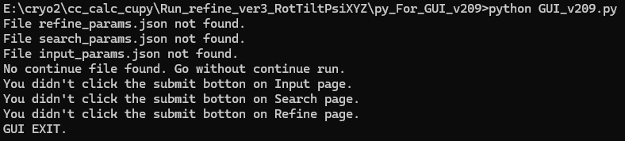
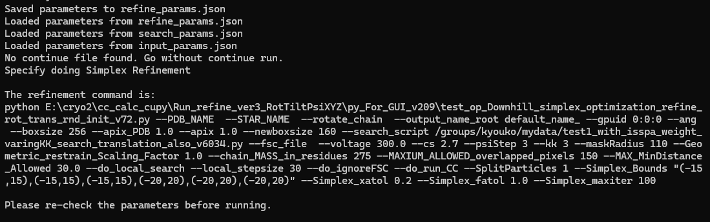

# GisAPR

**GPU-accelerated in situ Atomic Perturbation Refinement**

[中文使用手册](readme_chn.md)

GisAPR refines the rigid-body placement of one selected PDB chain against cryo-EM particle images. It samples changes to the chain, generates a model density, searches particle orientations with the optimized v606 search engine, and ranks the resulting conformations using particle-based scores. The remaining chains provide the fixed structural context.

The screenshots illustrate an earlier GUI layout. The instructions and parameter descriptions below follow version 210; old annotations are not specifications for the current program. Keep `README.md`, `readme_chn.md`, and the supplied `Pictures/` directory together, normally in the GisAPR installation directory.

## Contents

- [Installation](#installation)
- [Inputs and preparation](#inputs-and-preparation)
- [Quick start](#quick-start)
- [Using the GUI](#using-the-gui)
- [Command-line refinement](#command-line-refinement)
- [Continuing a run](#continuing-a-run)
- [Searching an existing MRC once](#searching-an-existing-mrc-once)
- [Geometric restraint](#geometric-restraint)
- [Scoring](#scoring)
- [Output files and BEST_FIT export](#output-files-and-best_fit-export)
- [GPU execution and working directories](#gpu-execution-and-working-directories)
- [Troubleshooting and retained limitations](#troubleshooting-and-retained-limitations)
- [Program map, validation, and credits](#program-map-validation-and-credits)


## Installation

Use Python **3.10 or newer**. Linux with an NVIDIA GPU is the intended environment for substantial runs. A CPU mode is available for small checks. The command examples use Bash; they are not Windows Command Prompt or PowerShell syntax.

First unpack the source package and set its absolute installation path:

```bash
export GISAPR_DIR=/absolute/path/to/GisAPR-210
python -m venv "$GISAPR_DIR/.venv"
source "$GISAPR_DIR/.venv/bin/activate"
python -m pip install --upgrade pip
```

Install a PyTorch build appropriate for your CUDA environment using the [official PyTorch installation selector](https://pytorch.org/get-started/locally/), then install the package requirements:

```bash
python -m pip install -r "$GISAPR_DIR/requirements.txt"
```

The refinement dependencies include NumPy, SciPy, PyTorch, mrcfile, einops, Matplotlib, scikit-learn, and joblib. The optional particle-preparation helper additionally needs `starfile`, which is not listed in the current `requirements.txt`:

```bash
python -m pip install starfile
```

The GUI requires Tkinter and a graphical display. Tkinter is supplied by the operating system or Python distribution, rather than installed with `pip`; on Debian/Ubuntu the corresponding system package is commonly `python3-tk`. The CLI can run without a display.

Check the active Python environment:

```bash
python -c "import torch; print('PyTorch:', torch.__version__); print('CUDA available:', torch.cuda.is_available()); print('Visible GPUs:', torch.cuda.device_count())"
```

The historical filenames `GUI_v209.py` and `CTF_cupy.py` are retained in 210. The latter uses NumPy and does not require CuPy. RELION, EMAN, and Chimera/ChimeraX are not imported by the refinement pipeline; they may be useful for upstream alignment, reconstruction, or model preparation.

## Inputs and preparation

### Required files

| Input | Purpose |
| --- | --- |
| Starting PDB | Contains the chain to move and the surrounding fixed chains. |
| Particle STAR and referenced MRC/MRCS images | Supply particle images, approximate orientations, and, when present, defocus information. Whitened and appropriately centered images are expected. |
| Orientation-sampling STAR | Supplies the model projection directions. Generate this explicitly; the historical default filename is not supplied as a ready-to-use dataset. |
| FSC curve, optional | Supplies radial Fourier weights. Omit it for unit FSC weights. |

Refine one chain at a time. To refine part of a chain as a separate rigid body, prepare a PDB that assigns that part its own chain identifier. `--rotate_chain` must identify a chain present in the input model.

### Coordinate frame and PDB conventions

The fixed part of the PDB should already agree with the particle alignment. For local searches, obtain usable particle orientations from an upstream alignment or reconstruction and fit the model into the corresponding map.

The density generator places a PDB coordinate into the volume as:

```text
voxel_position = coordinate_in_angstrom / apix_PDB + boxsize // 2
```

Thus **PDB coordinate (0, 0, 0) Å maps to the center of the generated box**. Refinement does not automatically recenter the starting PDB. Ensure that the model and centered particle images share this physical coordinate frame; changing an MRC header origin alone is not a substitute for checking the coordinates.

PDB coordinates are read from columns 31–54, the chain identifier from column 22, and the element from columns 77–78 with an atom-name fallback. Atom serial and residue number fields are preserved as text. The full transformed PDB retains the fixed chains and other records.

Use a single intended `MODEL` in the input: transformation/splitting uses the first model, while density and geometry readers can read all models. The retained density kernel normally uses `ATOM` records and supports H, C, N, O, P, and S. Other elements do not contribute density in this kernel. Coordinate transformation can retain `HETATM` records, but that does not make them part of the default density calculation.

### Particle STAR fields

The optimized search finds STAR loops by their labels. You do not need to change the file's first line to `# relion 30001` for this search.

| STAR label | Behavior in the optimized search |
| --- | --- |
| `_rlnImageName` | Required. Stack references such as `1@particles.mrcs` use one-based image indices. |
| `_rlnAngleRot`, `_rlnAngleTilt` | Required particle orientation fields. |
| `_rlnAnglePsi` | Optional; defaults to zero when absent. |
| `_rlnDefocusU`, `_rlnDefocusV`, `_rlnDefocusAngle` | CTF is used only when all three fields are present. Defocus values are in Å and the angle is in degrees. |
| `_rlnOriginX/Y`, `_rlnOriginX/YAngst` | Not applied by the search. Apply required image shifts before refinement. |
| Optics pixel size, voltage, and Cs | Not used to configure the search; provide the actual values through the CLI/GUI. |

Relative image paths are resolved from the **working directory**, not from the directory containing the STAR file. Use valid relative paths from that directory or absolute paths. The search uses one supplied particle pixel size, voltage, and Cs across the dataset; it does not apply per-optics-group settings. The retained CTF implementation uses amplitude contrast 0.1 and does not consume STAR phase-shift or amplitude-contrast fields.

### Centering and whitening particles

The search normalizes Fourier arrays and whitens model templates, but it does not perform the radial-amplitude whitening expected for the input particles. Use already prepared images or the included helper.

For a RELION STAR with `data_particles` and `data_optics`, apply the stored shifts and optionally crop the images:

```bash
python "$GISAPR_DIR/read_star_shift_crop_and_generate_new_star_v5.py" \
  --star_name particles.star \
  --output_root_name particles_whiten \
  --newboxsize 256 \
  --batchsize 5000 \
  --dowhitening
```

Here `256` is an example real-space output box size. Choose a positive even size no larger than the input images. This helper uses `rlnOriginXAngst`, `rlnOriginYAngst`, `rlnImageName`, and the first optics row's `rlnImagePixelSize`. It rounds shifts to integer pixels, zero-fills the exposed edges, center-crops, whitens, removes a fitted plane, normalizes, and resets the stored origins to zero.

For images that are already centered, preserve their original box size and skip shifting:

```bash
python "$GISAPR_DIR/read_star_shift_crop_and_generate_new_star_v5.py" \
  --star_name particles.star \
  --output_root_name particles_whiten \
  --newboxsize 0 \
  --batchsize 5000 \
  --dowhitening \
  --doSkipShifting
```

**Use `--newboxsize 0` with `--doSkipShifting` in this release.** The unchanged helper has an undefined-variable error when those skip-shifting calls use a positive crop size. The two commands above are alternative preparation routes; do not whiten the output a second time.

Outputs are `particles_whiten.star`, `particles_whiten_0001.mrcs`, and subsequent numbered stacks. Lower `--batchsize` if host RAM is limited. The helper's `--doOnlyMakeStar` option only rewrites references; it does not create or whiten image stacks.

### Generate the orientation list

For approximately 3° equal-area direction sampling:

```bash
python "$GISAPR_DIR/generate_healpix_order_and_relion_star.py" \
  --o c1_3deg.star --useEQPS --EQPSangleDegree 3.0 --apix 1.58
```

`--useEQPS` is necessary: setting `--EQPSangleDegree` alone does not select EQPS sampling. Alternatively, generate a HEALPix grid:

```bash
python "$GISAPR_DIR/generate_healpix_order_and_relion_star.py" \
  --o c1_healpix4.star --healpixOrder 4 --apix 1.58
```

When appropriate for the model and dataset, the symmetry-aware generator can reduce equivalent projection directions:

```bash
python "$GISAPR_DIR/generate_healpix_order_and_relion_star_symgroup_v2.py" \
  --o d7_3deg.star --useEQPS --EQPSangleDegree 3.0 --sym D7 --apix 1.58
```

Supported symmetry names include `C1`, `Cn`, `Dn`, `tet`, `oct`, `I2`, and `I3`; `I`, `ico`, and `icos` alias `I2`. This reduces projection directions; it does not impose symmetry on PDB perturbations. Use the symmetry appropriate to the actual search model, which may change when a single subunit moves.

The generator's `--discardPositiveRot` option removes directions and is not required for a general full-direction list. The search's in-plane sampling is controlled by `--psiStep`, independently of the generator's stored Psi values. Set microscope parameters in the refinement command, regardless of the optics metadata written into an angle STAR.

### Pixel size and box size

| Parameter | Meaning |
| --- | --- |
| `--apix` / Particle Apix | Particle pixel size in Å/pixel. |
| `--apix_PDB` / PDB Apix | Sampling used to rasterize the PDB into a model MRC; PDB coordinates remain in Å. Usually start with the same value as the particle pixel size. |
| `--boxsize` / Boxsize | Actual real-space particle box size and generated model box size. |
| `--newboxsize` / Search boxsize in pixel | Central Fourier crop size used during search. This is different from the preparation helper's real-space crop option. |

Use positive even box sizes, with `32 <= newboxsize <= boxsize` for the ordinary wrappers and their default CCG crop. Fourier cropping preserves the field of view and gives an effective search pixel size of `boxsize / newboxsize * apix`.

Changing `apix_PDB` changes the model's scale relative to the images, approximately by the factor `apix / apix_PDB`; it does not edit the PDB coordinates. Use [pixel-size search](#pixel-size-grid-search) when deliberately calibrating that relative scale. Candidate density generation uses a resolution parameter of `2 * apix_PDB`.

### Optional FSC

For the usual no-FSC workflow, omit `--fsc_file` entirely or leave the GUI field blank. The search then initializes unit FSC weights.

To apply a curve, use `--fsc_file curve.fsc` in an optimizer, or `--FSC curve.fsc` in the one-shot wrapper. The reader expects headerless, whitespace-separated numerical rows and reads the **second column** sequentially as radial-shell weights; it ignores the first column. Unspecified higher-radius shells receive zero weight.

In the GUI, uncheck **Do ignore FSC** if you supply a curve and want its values used. The CLI equivalents are `--do_ignoreFSC` for optimizers and `--ignoreFSC` for the one-shot wrapper. These ignore flags still open a supplied file and retain its radial support while replacing its parsed weights with one. To use no curve at all, remove the filename rather than naming a missing file and adding an ignore flag.

## Quick start

Create a separate working directory for each independent run. The examples assume that `model.pdb`, `particles_whiten.star`, its referenced stacks, and `c1_3deg.star` are accessible there. Replace the example box size, pixel size, mask radius, microscope settings, and chain ID with your own values.

```bash
cd /absolute/path/to/your/run_directory
export GISAPR_DIR=/absolute/path/to/GisAPR-210

python "$GISAPR_DIR/test_op_Particle_Swarm_optimization_refine_rot_trans_ver622.py" \
  --PDB_NAME model.pdb \
  --STAR_NAME particles_whiten.star \
  --rotate_chain A \
  --ang c1_3deg.star \
  --output_name_root pso_ \
  --boxsize 256 --newboxsize 160 \
  --apix 1.58 --apix_PDB 1.58 \
  --voltage 300 --cs 2.7 --maskRadius 110 \
  --do_local_search --local_stepsize 20 --psiStep 3 --kk 3 \
  --gpuid 0 --max_workers 1 --SplitParticles 1 \
  --do_run_CC --do_simple_sum \
  --skip_geometric_restraint \
  --PSO_num_particles 3 --PSO_iterations 30 \
  --PSO_Bounds '(-15,15),(-15,15),(-15,15),(-20,20),(-20,20),(-20,20)' \
  --PSO_pivot_point '[0,0,0,0,0,0]'
```

This example uses local particle-orientation search, exponential CC aggregation with the corrected scorer, no FSC, and no geometric rejection. To enable geometric restraint, remove `--skip_geometric_restraint` and set suitable limits as described below. Thirty PSO iterations is an example budget, not a convergence guarantee.

After normal completion, inspect the printed greatest score, the `*_BEST_FIT.pdb`, and `pso_BEST_FIT.json`. Larger raw scores are better. Optimizer logs instead report the negative score, for which smaller is better.

## Using the GUI

Launch the GUI **from the data working directory**:

```bash
python "$GISAPR_DIR/GUI_v209.py"
```

The script retains its original filename in version 210. It finds the packaged refinement and search scripts relative to its own installation directory. Relative data paths still refer to the working directory.



### 1. Input Files

Enter the particle STAR, starting PDB, selected chain, orientation list, box size, particle/PDB pixel sizes, voltage, and Cs. FSC is optional. The historical subunit-mass field is retained for compatibility and does not change the accepted image score in the current evaluation path.

Click **Submit** on this page before switching away.



### 2. Search Parameters

Choose the search box size, mask radius, in-plane step, isSPA `n` (`kk`), and local-search range. Keep local search enabled when the particle orientations provide a useful starting point. The GUI's **Do run CC** and **Do simple sum** checkboxes select the scoring mode described in [Scoring](#scoring).

The GUI defaults differ from CLI defaults: local search, CC mode, and ignoring FSC are checked by default, while simple sum is not. Check **Do simple sum** as well as **Do run CC** to request the corrected exponential CC mode. Supplying an FSC filename does not automatically uncheck **Do ignore FSC**.

The ordinary refinement panel no longer exposes **Mask Soft Edge in pixel**; that path uses its default of 6 pixels. The separate Refine Once panel still exposes mask edge. The retained GPU-projection checkbox is a compatibility control; model projections in the optimized workflow are already generated through PyTorch.

Click **Submit**.



### 3. Refine Parameters

Set the output root, GPU IDs, geometric thresholds or **Skip geometric restraint**, and the algorithm. Use GPU IDs such as `0` or `0:1`; the historical displayed value `0:0:0` refers repeatedly to the same device.

Version 210 offers four algorithms in this panel:

| Algorithm | Main controls |
| --- | --- |
| Grid Search | Six bounds and angular/translational sampling intervals. |
| Simplex | Six bounds, maximum iterations, `xatol`, and `fatol`. The old explicit/random-initial-simplex GUI fields have been removed. |
| Particle Swarm Optimization (PSO) | Six bounds, swarm size, iterations, inertia weights, and six-dimensional pivot. |
| Pattern search | Six bounds, optional initial point, initial step, tolerance, expansion/shrink factors, and maximum iterations. |

The GPU-worker field controls candidate dispatch for Grid, PSO, and Pattern Search. Simplex evaluates its objective sequentially. The legacy CPU-worker field is only forwarded for Grid and does not control worker creation in the rewritten evaluation path. Pixel-size grid search is available through the CLI.

Click **Submit** after setting the chosen algorithm.







### 4. Continue Run Parameters, when needed

Select PSO, Pattern search, or Simplex in Refine Parameters. In Continue Run Parameters, enable **Do continue run**, choose the matching checkpoint, and enter **Continue Run this more rounds**. Submit both pages. The additional-round count is a maximum for methods that can stop on convergence.

For a new run, uncheck **Do continue run** and submit again. Grid Search does not support this checkpoint workflow.



### 5. Close the GUI and run the printed command

The GUI generates a command; it does **not** start refinement. After submitting all required pages, close the window and copy the command printed in the terminal. Run it from the same data working directory and Python environment.

The saved configurations are `input_params.json`, `search_params.json`, `refine_params.json`, and `continue_params.json` in the working directory. Switching panels or closing the window does not save unsubmitted edits. If required pages are missing, 210 reports `Submit parameters on these pages before closing: Input, Search, Refine`, listing the pages that still need submission.





### Refine Once Parameters

This additional 210 panel searches an existing model MRC against particles. Supply **Particle Star file**, **Model MRC file**, and **Angle list**, then set the search parameters and submit. FSC is optional. The generated command uses `wrap_to_search_v2.py` and local search. This panel does not optimize a PDB chain or generate a BEST_FIT PDB.

**A saved, nonempty `once_params.json` takes priority over the ordinary refinement pages when the GUI closes.** To return to conventional refinement command generation, move that file aside before launching the GUI:

```bash
mv once_params.json once_params.saved.json
```

Only run this command if `once_params.json` exists; choose another backup name if needed. The uploaded screenshots do not show the new Refine Once or Pattern Search panels.

## Command-line refinement

### Shared settings and parameter units

All pose optimizers operate on six parameters in this order:

```text
(rot, tilt, psi, tx, ty, tz)
```

The first three are **rotation-vector components in degrees**, despite their historical `rot/tilt/psi` labels. The PDB transformation uses `Rotation.from_rotvec`, rather than a RELION ZYZ Euler rotation. The last three are translations in Å. By default, the selected chain rotates about its own arithmetic coordinate center before translation. This physical rotation center is distinct from the PSO pivot.

| Common option | Meaning / usual CLI default |
| --- | --- |
| `--PDB_NAME`, `--STAR_NAME`, `--rotate_chain` | Required model, particles, and moving chain. |
| `--ang` | Model-orientation STAR. Supply your generated file explicitly. |
| `--output_name_root` | Prefix for candidate artifacts, optionally including a directory. Use a distinct prefix per independent run. |
| `--boxsize`, `--newboxsize` | Real-space box and search Fourier box; pose-optimizer defaults are 256 and 160. |
| `--apix`, `--apix_PDB` | Particle and model sampling in Å/pixel; defaults are 1.58. |
| `--voltage`, `--cs` | kV and mm; defaults are 300 and 2.7. |
| `--maskRadius` | Real-space mask radius in original particle pixels; default 110. Adapt it to your box and particle. |
| `--psiStep` | In-plane angular sampling step in degrees; optimizer default 3. |
| `--kk` | isSPA weighting parameter, shown as `isSPA n` in the GUI; optimizer default 3. |
| `--do_local_search` | Restrict model directions around the supplied particle orientations. Without this flag, the CLI searches the supplied direction list globally. |
| `--local_stepsize` | Local angular range in degrees, despite the historical “stepsize” name; default 30. Does not set the angle-list spacing. |
| `--transRange` | Compatibility argument, default 0. The optimized engine obtains image translation from the CCG peak; this option is not a PDB translation bound. |
| `--fsc_file`, `--do_ignoreFSC` | Optional curve and its ignore switch. See the FSC section. |
| `--do_run_CC`, `--do_simple_sum` | Score-mode switches. Both default off in the four pose-optimizer CLIs. |
| `--skip_geometric_restraint` | Disable geometric calculation and rejection. Normally off for pose refinement. |
| `--gpuid` | Colon-separated logical CUDA IDs, default `0`; `cpu` is available for small checks. |
| `--SplitParticles` | Number of STAR chunks; default 1. |
| `--doSplitDiffGpu` | Distribute chunks across devices; see GPU execution below. |
| `--yflip` | Apply the historical EMAN-style Y flip to the generated density. Use only when required by your coordinate convention. |

Algorithm defaults and GUI defaults are not identical. Specify the settings that matter to your experiment. Each script also supports `--help` for the full parser listing.

For the following examples, define a Bash array once in the working directory:

```bash
COMMON=(
  --PDB_NAME model.pdb
  --STAR_NAME particles_whiten.star
  --rotate_chain A
  --ang c1_3deg.star
  --boxsize 256 --newboxsize 160
  --apix 1.58 --apix_PDB 1.58
  --voltage 300 --cs 2.7 --maskRadius 110
  --do_local_search --local_stepsize 20 --psiStep 3 --kk 3
  --gpuid 0 --SplitParticles 1
  --skip_geometric_restraint
)
```

These are alternatives, not a required sequence. Run each independent optimization in its own directory, with the needed input paths and `COMMON` defined there.

### PSO

```bash
python "$GISAPR_DIR/test_op_Particle_Swarm_optimization_refine_rot_trans_ver622.py" \
  "${COMMON[@]}" --output_name_root pso_ \
  --do_run_CC --do_simple_sum --max_workers 1 \
  --PSO_num_particles 3 --PSO_iterations 30 \
  --PSO_Bounds '(-15,15),(-15,15),(-15,15),(-20,20),(-20,20),(-20,20)' \
  --PSO_pivot_point '[0,0,0,0,0,0]'
```

`--PSO_num_particles` means swarm members, not cryo-EM images. The pivot is a six-dimensional attraction point in the same parameter units as the pose. The default zero pivot attracts toward the starting model pose. Changing it does not change the physical center about which atoms rotate. PSO retains its existing soft-bound behavior, so sampled positions can slightly exceed the nominal bounds.

Optional controls include `--PSO_wmax`/`--PSO_wmin` (defaults 0.9/0.4) and `--PSO_add_noise_velocities`, with noise strength and decay controlled by `--PSO_noise_strength` and `--PSO_noise_decay_per_round`. Surrogate guidance is opt-in with `--PSO_use_surrogate`; its training schedule and weight have `--PSO_surrogate_*` options. Leave it off unless it is part of your chosen protocol.

### Pattern Search

```bash
python "$GISAPR_DIR/test_op_pattern_search_try_multithreading_v3.py" \
  "${COMMON[@]}" --output_name_root pattern_ \
  --do_run_CC --do_simple_sum --max_workers 1 \
  --Pattern_Bounds '(-15,15),(-15,15),(-15,15),(-20,20),(-20,20),(-20,20)' \
  --Pattern_given_initial --Pattern_initial '[0,0,0,0,0,0]' \
  --Pattern_stepsize 1 --Pattern_tol 0.01 \
  --Pattern_expand 1.2 --Pattern_shrink 0.5 --Pattern_max_iter 500
```

The initial-point string is used only when `--Pattern_given_initial` is present. Pattern Search polls neighboring poses and adjusts its step according to improvement. The scalar step applies to each coordinate in that coordinate's degree or Å unit. It can stop before the maximum iteration count when the step reaches tolerance.

### Simplex

```bash
python "$GISAPR_DIR/test_op_Downhill_simplex_optimization_refine_rot_trans_rnd_init_v72.py" \
  "${COMMON[@]}" --output_name_root simplex_ \
  --do_run_CC --do_simple_sum \
  --Simplex_Bounds '(-15,15),(-15,15),(-15,15),(-20,20),(-20,20),(-20,20)' \
  --Simplex_maxiter 100 --Simplex_xatol 0.2 --Simplex_fatol 1.0
```

Simplex uses an initial simplex within the bounds and refines it with a Nelder–Mead-style procedure. `xatol` controls parameter spread and `fatol` controls objective spread; use score-consistent tolerances. The current objective evaluations are sequential, even when multiple GPU IDs are supplied. Keep the pose dimension at six.

### Pose Grid Search

```bash
python "$GISAPR_DIR/test_op_GridSearch_refine_rot_trans_v321.py" \
  "${COMMON[@]}" --output_name_root grid_ \
  --do_run_CC --do_simple_sum --max_workers_GPU 1 \
  --Grid_Bounds '(-5,5),(-5,5),(-5,5),(-5,5),(-5,5),(-5,5)' \
  --Grid_Rotation_Stepsize 5 --Grid_Translation_Stepsize 5
```

This example contains three samples per dimension and therefore 729 candidate poses. Grid cost grows as the product of the six sampling counts. Angular steps are in degrees; translation steps are in Å. Grid Search does not provide iterative checkpoint continuation.

### Pixel-size Grid Search

```bash
python "$GISAPR_DIR/test_op_PixelSize_GridSearch.py" \
  "${COMMON[@]}" --output_name_root pixelsize_ \
  --Pixelsize_Bounds '(-0.05,0.05)' \
  --Pixelsize_stepsize 0.01 --max_workers_GPU 1
```

The bounds are **offsets added to `--apix_PDB`**, in Å/pixel. With `apix_PDB=1.58`, the example targets approximately 1.53–1.63 Å/pixel. Particle `--apix` stays fixed. The adapter evaluates zero pose and varies model rasterization sampling, so the copied PDB alone does not encode the winning sampling value; retain the output label and run settings as well.

Supply any existing chain ID. Pixel-size search uses CC plus simple-sum mode internally and does **not** accept `--do_run_CC` or `--do_simple_sum`; do not add those two flags to this command. It skips geometric restraint by default. To opt in, remove the skip flag from `COMMON`, add `--enable_geometric_restraint`, and set meaningful overlap/distance limits; its inherited threshold defaults are extremely permissive. Pixel-size search is CLI-only and has no iterative checkpoint continuation.

## Continuing a run

Checkpoints are written in the working directory. Continue with the **same method, starting PDB, images, chain, scoring script/mode, search settings, and output root**. Repeat the original command and append the appropriate options:

| Method | Checkpoint naming | Options to append for up to 20 additional rounds |
| --- | --- | --- |
| PSO | `my_pso_state_round_N.npz` | `--PSO_continue --PSO_continue_file my_pso_state_round_30.npz --PSO_continue_more_rounds 20` |
| Pattern Search | `my_pattern_state_round_N.npz` | `--Pattern_continue --Pattern_continue_file my_pattern_state_round_30.npz --Pattern_continue_more_rounds 20` |
| Simplex | `my_simplex_state_round_N.npz` | `--Simplex_continue --Simplex_continue_file my_simplex_state_round_30.npz --Simplex_continue_more_rounds 20` |

Replace the example checkpoint with a file that actually exists. All three also accept the equivalent generic aliases `--continue_run`, `--continue_file`, and `--continue_more_rounds`. Do not supply both forms unnecessarily.

PSO restores swarm positions, velocities, best states, history, and random state. Pattern Search restores its current point, step, and stopping settings. Simplex restores all simplex vertices and their scores, rather than starting again at the best vertex. Their round counters represent different operations; a Simplex checkpoint's first round includes the initial simplex evaluation.

Additional rounds are not an instruction to discard convergence criteria. Pattern Search or Simplex may stop immediately if the restored state is already converged. PSO's `--PSO_continue_reset_velocities` optionally perturbs both velocities and positions, so leave it absent for ordinary continuation. An explicitly supplied PSO pivot overrides the saved pivot.

Do not mix linear-sum and corrected exponential-score results in one continuation. Use a fresh run when changing that scoring definition, since checkpoints contain previously computed objective values. No checkpoint compatibility with older, unrelated Simplex implementations is implied.

## Searching an existing MRC once

Use `wrap_to_search_v2.py` for particle search with an existing model MRC and orientation list. This bypasses PDB pose optimization and geometric restraint.

If needed, create the model MRC explicitly:

```bash
python "$GISAPR_DIR/pdb2mrc_gpu_ver_fp32_v3.py" \
  --i model.pdb --o model.mrc \
  --box 256 --apix 1.58 --res 3.16 --gpuid 0
```

This command keeps the PDB coordinate frame. The standalone generator also offers `--center`, but use it only if you deliberately want to change that frame. For CPU density generation, use `--device cpu`.

Run the search:

```bash
python "$GISAPR_DIR/wrap_to_search_v2.py" \
  --script "$GISAPR_DIR/test1_with_isspa_weight_varingKK_search_translation_also_v606_torch_optimized_standalone.py" \
  --i c1_3deg.star --ang c1_3deg.star \
  --mrc model.mrc --p particles_whiten.star --o search_once.txt \
  --oriboxsize 256 --newboxsize 160 --apix 1.58 \
  --voltage 300 --cs 2.7 --maskRadius 110 --maskEdge 6 \
  --psiStep 3 --kk 3 --transRange 0 \
  --doLocalSearch --localRange 20 \
  --gpuid 0 --SplitParticles 1
```

The optimized engine retains `--i` for compatibility and reads directions from `--ang`; use the angle list for both in this wrapper. The model MRC must have the matching box size and coordinate frame. Search sampling is set by the explicit arguments, so do not rely on the MRC header alone to configure pixel size.

FSC is omitted in this example. To use a curve, append `--FSC curve.fsc`. To search all directions in the supplied list from the CLI, omit `--doLocalSearch` and `--localRange`. GUI Refine Once always generates a local-search command.

This wrapper writes the raw search output. To aggregate its score separately, create an index containing `search_once.txt` and invoke the scoring script as described next. It does not automatically create optimizer checkpoints or a BEST_FIT PDB.

## Geometric restraint

With restraint enabled, each candidate is tested against the fixed mainbody before density/search/scoring proceeds. The calculation measures the number of overlapping binary-mask voxels and the minimum distance between the selected-chain and mainbody masks.

The rejection condition is:

```python
overlap >= MAXIUM_ALLOWED_overlapped_pixels or distance >= MAX_MinDistance_Allowed
```

The distance is in Å. The overlap is a voxel count, despite the historical option spelling “pixels.” The equality case is rejected too. The normal evaluation path uses a separate geometry grid with box size 256, pixel size 1.5 Å, and density threshold 1.0; this is not the cropped search grid.

| Workflow | Default maximum overlap | Default maximum minimum-distance |
| --- | --- | --- |
| PSO, Pattern Search, Simplex CLI | 300 | 30 Å |
| Pose Grid Search CLI | 130 | 20 Å |
| GUI-generated pose refinement | 150 unless edited | 30 Å unless edited |
| Pixel-size search | Disabled by default | Disabled by default |

For explicit limits, add for example:

```text
--MAXIUM_ALLOWED_overlapped_pixels 300 --MAX_MinDistance_Allowed 30
```

Choose thresholds for your model and protocol; the example values are not universal geometric criteria. A rejected candidate returns the preset optimizer objective `overlap + MAX_MinDistance_Allowed` and skips the image search. An accepted candidate returns only the **negative image-derived score**. Overlap and distance are never added to an accepted score. The legacy `Geometric_restrain_Scaling_Factor` and `chain_MASS_in_residues` settings do not modify that accepted score.

Use `--skip_geometric_restraint`, or the GUI checkbox, to skip the entire geometric calculation and both rejection conditions. The permanent worker reuses fixed geometry information when restraint is enabled, avoiding a fresh chain/mainbody density-file workflow for each sample. Geometry text diagnostics remain available for checked poses.

## Scoring

The optimized search writes per-particle results; `new_method_to_fit_the_2nd_Gaussian_PEAK_v4.py` aggregates them. For CC processing, the script defines `c_i = raw_CC_i / 1024`. For Z-score processing, it retains values below 9999.

| Optimizer flags | Standalone scorer arguments | Successful-fit aggregate |
| --- | --- | --- |
| `--do_run_CC --do_simple_sum` | `1 1` | Corrected mode: `sum(exp(c_i))`. |
| `--do_run_CC` | `1 0` | Peak-based CC statistic. |
| `--do_simple_sum` | `0 1` | Direct sum of the retained Z-scores. |
| Neither flag | `0 0` | Peak-based Z-score statistic. |

For a peak-based statistic, the script takes the larger of the two fitted Gaussian means, `mu`, and evaluates `count(x > mu) * mu + sum(x[x > mu])`. Fitted parameters and peak-detection diagnostics are printed to the terminal; this script does not save plot images.

“Simple sum” retains the historical name. Even in that mode, the script attempts the Gaussian fit before replacing the successful-fit aggregate with the selected sum. **If the fit fails, the unchanged fallback returns the direct sum of the selected CC or Z-score values.** It does not use the exponential CC sum in that fallback. Empty input returns zero.

To identify the corrected CC script, check that the successful CC branch under `if do_simple_sum > 0` contains:

```python
total_estimated_sum_cc = np.sum(np.exp(CC_data))
```

Other occurrences of `np.sum(CC_data)`, including the failure fallback, are intentional. The exponential and direct sums have different numerical values and should not be mixed within a result collection. Keep the particle set and score mode fixed when comparing conformations.

For standalone debugging, make `index.txt` contain one raw search filename per line, then run:

```bash
python "$GISAPR_DIR/new_method_to_fit_the_2nd_Gaussian_PEAK_v4.py" \
  index.txt 1 1 score.txt
```

Run from a directory where the filenames in the index resolve correctly. Each result is recorded as two lines: the search filename, then the aggregate score followed by diagnostic numeric fields. The **first numeric field on the second line** is the score used for ranking. Larger is better; the optimizer minimizes its negative.

## Output files and BEST_FIT export

Candidate filenames retain the existing pose encoding, for example:

```text
rotN1p2_tiltN11p7_psi4p2deg_trans2p1_8p1_N4p8ANG
```

`N` denotes a minus sign and `p` a decimal point. The pose fields are intentionally rounded to one decimal place for filenames. The encoded translations are in Å. The `rot/tilt/psi` filename labels retain the rotation-vector meaning described above.

| Artifact | Contents |
| --- | --- |
| `<root><chain>_<pose>.pdb` | Full model with the selected chain transformed. |
| Candidate `.mrc` | Model density read by the optimized search; these files can be large. |
| `search_v606opt_*.txt` | Per-particle search results, retaining the existing format. The historical `orient3degree` filename text does not necessarily describe your actual angle-list spacing. |
| `index_for_result_*.txt` | Input index for the independent scoring script. |
| `ReSuLt_*.txt` | Two-line filename/aggregate-score records. |
| `*_GeometricRestrain_Result.txt` | Geometry diagnostics for poses whose restraint was evaluated. |
| `RUN01_*_generate_models_from_pdb.sh`, `RUN01_*_search_script.sh` | Recorded commands for debugging and replay. |
| Gaussian diagnostics in terminal output | Fitted parameters, detected peaks, and aggregate values from the separate scoring script. |
| `my_*_state_round_N.npz` | PSO, Pattern Search, or Simplex checkpoint state. |

All five `test_op` workflows call the result exporter on **normal completion**. It collects score files matching the run's output root and chain, selects the greatest raw score, finds the corresponding original candidate PDB, and copies it to:

```text
<winning_candidate_pdb_stem>_BEST_FIT.pdb
```

It also writes `result.log` and `<output_root_basename>BEST_FIT.json` in the output directory. The JSON records the score, search/result filenames, source PDB, copied PDB, and result count. Matching scores from earlier work under the same root are included, which supports continuation. Use a new root and working directory for a separate experiment.

Keep the candidate PDBs and `ReSuLt_*.txt` files until export finishes. Geometrically rejected candidates have no completed image score and do not enter this selection. If no completed scores exist, no BEST_FIT PDB is created. A forced termination can leave export unfinished; rerun it explicitly after checking the available results:

```bash
python "$GISAPR_DIR/gisapr_results.py" --output_name_root pso_
```

This standalone command selects by the supplied prefix, so use the exact, distinct root for the intended run.

The original manual score-inspection workflow remains available. In a directory containing only the intended run's result files:

```bash
cat ReSuLt_*.txt > result.log
python "$GISAPR_DIR/read_Result_print_max.py" --i result.log
```

The helper prints the greatest score and associated search filename. Automatic export performs the corresponding PDB lookup and copy as well, so no manual pose-token search is required after a normal optimizer run.

## GPU execution and working directories

For one GPU, use `--gpuid 0`. For two visible GPUs, use `--gpuid 0:1`. IDs are logical indices after `CUDA_VISIBLE_DEVICES` has been applied. Repeated IDs such as `0:0:0` share a single worker and do not represent three GPUs.

| Method | Candidate-dispatch option |
| --- | --- |
| PSO, Pattern Search | `--max_workers` |
| Pose Grid, Pixel-size Grid | `--max_workers_GPU` |
| Simplex | Objective evaluations remain sequential. |

For example, use `--gpuid 0:1 --max_workers 2 --SplitParticles 1` for candidate parallelism in PSO or Pattern Search. Use `--max_workers_GPU 2` for the grid methods. Each device serializes its own requests.

Particle splitting is separate: `--SplitParticles N` divides the STAR into chunks, and `--doSplitDiffGpu` distributes them over the available IDs. Without that switch, chunks stay on the candidate's assigned GPU. If only one numeric GPU ID is supplied with the different-GPU switch, the wrapper expands it into consecutive IDs based on the chunk count. Supply an explicit list, such as `0:1`, when you want to control the allowed devices. Do not request GPUs outside your job allocation.

Workers start sequentially and remain alive during the optimizer run. This avoids repeated PyTorch imports during sampling, including the repeated startup cost seen with Python environments on NFS. The first worker startup still takes time. Geometry, density generation, and search reuse those workers; the Gaussian scoring script remains a separate diagnostic step.

For a small CPU check, replace optimizer/wrapper `--gpuid 0` with `--gpuid cpu`. CPU execution is not a substitute for measuring a production GPU workload. GPU memory needs depend on box sizes, orientation count, and workload; the old screenshot's 48 GB annotation is not a universal requirement.

Input paths, GUI JSON files, and checkpoint/log filenames depend on the working directory. Candidate artifacts follow `--output_name_root`'s directory, but checkpoint and optimizer-log files still use the working directory. Separate run directories also prevent one run's `result.log` or GUI configuration from overwriting another's.

## Troubleshooting and retained limitations

| Symptom | Check / action |
| --- | --- |
| Missing angle STAR | Generate a list and pass `--ang`; do not depend on the historical default filename. |
| Missing image stack despite a valid STAR | Resolve `_rlnImageName` paths from the working directory. |
| FSC error when FSC should be unused | Remove the FSC filename. An ignore flag still opens a supplied file. |
| GUI prints no refinement command | Submit Input, Search, and Refine pages before closing. |
| GUI unexpectedly prints Refine Once | Move aside the saved `once_params.json`. |
| GUI cannot open | Use a Python installation with Tkinter and a graphical display, or use the CLI. |
| Particle-preparation import error | Install `starfile` in the active environment. |
| Undefined `shifted_image` during preparation | Use `--newboxsize 0` with `--doSkipShifting`, or use the shift-applying preparation route. |
| Unexpectedly coarse EQPS list | Include `--useEQPS`; `--EQPSangleDegree` alone does not select EQPS. |
| Most candidates skip image search | Inspect geometry diagnostics, input coordinate frame, and thresholds; use the skip flag when the protocol does not require restraint. |
| Unexpected score scale | Check the installed scoring correction, score-mode flags, particle set, and whether Gaussian fitting entered its direct-sum fallback. |
| No BEST_FIT PDB | Check for completed matching scores and retained candidate PDBs; run the exporter if execution stopped before finalization. |
| Continuation stops immediately | Pattern Search or Simplex may already satisfy the saved convergence criteria. |
| GPU memory exhausted | Reduce workload dimensions or concurrent candidate dispatch; verify that requested devices match the allocated GPUs. |

`read_search_txt_pick_good_v2p4.py` is retained as a historical particle-selection helper. Its STAR-header parsing and particle-index handling require validation against the current search output before using exported selections. It is not part of the verified automatic refinement/BEST_FIT workflow; check that selected and rejected particles account for the intended input set. This documentation update does not change that helper or the particle-preparation code.

## Program map, validation, and credits

| File | Role |
| --- | --- |
| `GUI_v209.py` | Version-210 GUI and command construction. |
| `test_op_*.py` | Optimizer entry points described above. |
| `func.py`, `func_for_PixelSize_search.py` | Shared conformation evaluation and pixel-size adaptation. |
| `gisapr_runtime.py`, `gisapr_worker.py` | Permanent worker lifecycle and requests. |
| `pdb_text.py` | Text-based PDB coordinate handling. |
| `pdb2mrc_gpu_ver_fp32_v3.py` | PyTorch model-density generation; historical filename retained. |
| `func_check_boundary_for_testing_v8.py` | Geometric restraint implementation. |
| `wrap_to_search_v2.py` | MRC/angle-list search wrapper and particle splitting. |
| `test1_with_isspa_weight_varingKK_search_translation_also_v606_torch_optimized_standalone.py` | Optimized particle-search engine. |
| `new_method_to_fit_the_2nd_Gaussian_PEAK_v4.py` | Independent score aggregation and Gaussian diagnostics. |
| `optimizer_checkpoint.py` | Shared continuation support. |
| `gisapr_results.py`, `read_Result_print_max.py` | Automatic BEST_FIT export and manual score inspection. |

The source package includes `tests/` and `VALIDATION.md`. To run the included checks, install pytest in the chosen environment and execute:

```bash
python -m pip install pytest
cd "$GISAPR_DIR"
python -m pytest -q tests
```

Read `VALIDATION.md` for the scope of the delivered checks. CPU checks do not establish production CUDA performance, NFS startup speed, or scientific accuracy on a new dataset. Some original-version comparison checks may require the supplied 209 reference files.

The project retains these implementation credits from the original package:

- Central Fourier-slice extraction was adapted from [libtilt](https://github.com/teamtomo/libtilt).
- Equal-sphere partitioning was ported from [EqualSpherePartition's Fortran implementation](https://github.com/GongZheng-Justin/EqualSpherePartition/blob/main/ACM_EqualSphere.f90).
- The HEALPix and whitening helpers were inspired by RELION.
- Model-density generation was inspired by EMAN's `pdb2mrc`.

The package includes a GNU GPL version 3 license in `LICENSE`. Consult the distributed license and retained source notices when redistributing the code.
